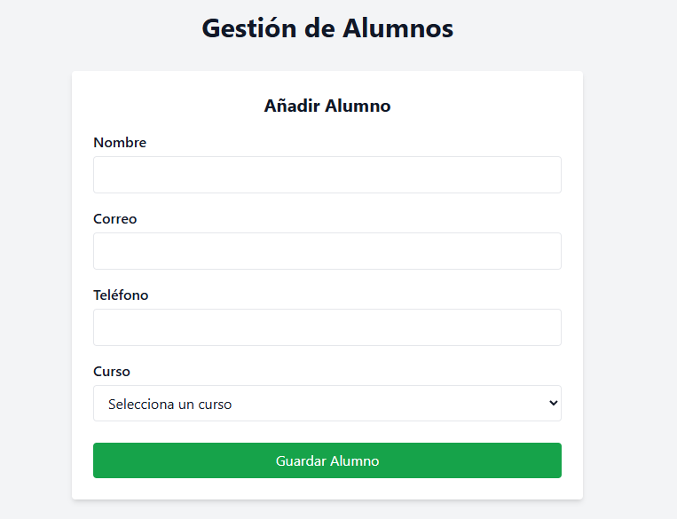
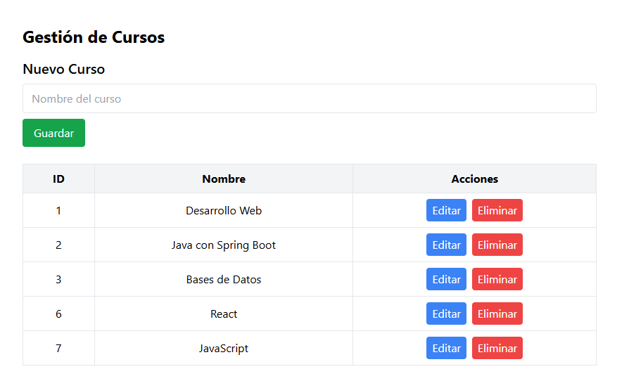
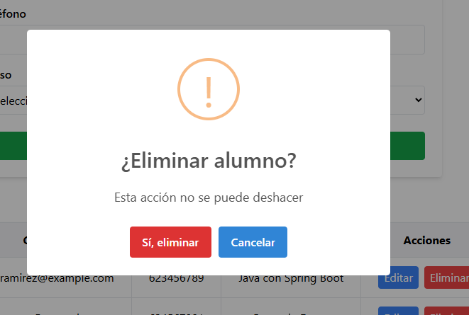

# 📚 Gestión de Cursos y Alumnos – Full Stack App

Aplicación web completa para la gestión de cursos y alumnos, desarrollada con **Java Spring Boot + React + Tailwind CSS**. Permite crear, visualizar y eliminar registros de manera fluida desde una interfaz moderna y profesional.

---

## 🖼️ Capturas de pantalla

### 🧍‍♂️ Formulario de Alumnos


### 📋 Tabla de Alumnos


### 📚 Tabla de Cursos


### ⚠️ Ventana de Confirmación al Eliminar


---

## 🛠️ Tecnologías Utilizadas

### Backend:
- ☕ Java 17
- 🌱 Spring Boot 3
- 🐘 PostgreSQL
- 🔄 CORS + Controladores REST
- 🧪 JPA (Hibernate)

### Frontend:
- ⚛️ React
- 💨 Tailwind CSS
- 🍬 SweetAlert2
- ⚙️ Vite

---

## ✨ Características

- Crear, listar y eliminar cursos y alumnos
- Edición de alumnos en tiempo real
- Relación entre alumnos y cursos
- Alertas modernas con SweetAlert2
- Diseño responsive y limpio con Tailwind
- Backend modular y desacoplado
- Código organizado por componentes

---

## 🚀 Instalación y ejecución

### 1. Clonar repositorio

```bash
git clone https://github.com/tu-usuario/gestion-cursos-alumnos.git
cd gestion-cursos-alumnos
cd backend
./mvnw spring-boot:run

cd frontend
npm install
npm run dev
```
Asegúrate de tener PostgreSQL corriendo y la base de datos configurada en application.properties.


---


## 🔗 API REST – Endpoints

###📍 Cursos
GET /api/cursos → Listar cursos

POST /api/cursos → Crear curso

DELETE /api/cursos/{id} → Eliminar curso

### 👤 Alumnos
GET /api/alumnos → Listar alumnos

POST /api/alumnos → Crear alumno

DELETE /api/alumnos/{id} → Eliminar alumno

---

## 🧑‍💻 Autor
### Jose Luis “Payoyo” Rodríguez

Desarrollo backend, eficiencia, solidez en sistemas y crecimiento profesional continuo. Formándome para trabajar en empresas tecnológicas de alto nivel.

<p align="center">  </p>

